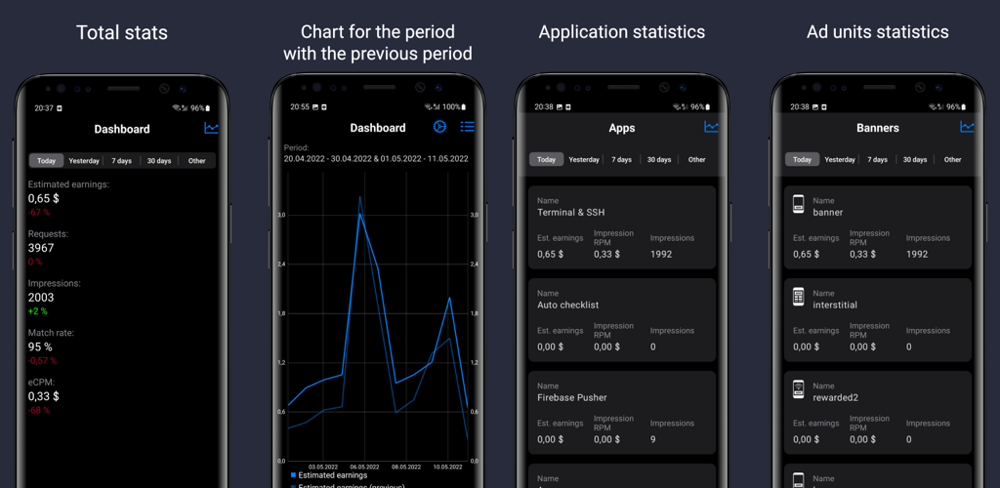
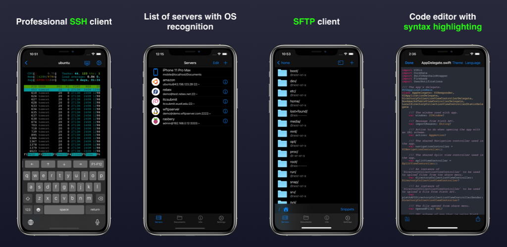
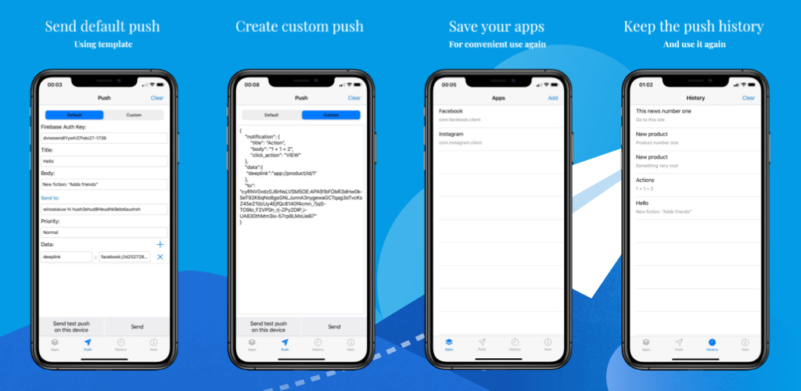

## Hi there 👋

## About me
- 👨‍💻 Developer from Ukraine.
- 🇺🇦 Russian warship FUCK YOU.

## My projects

### AdStat

AdStat is the best app to track your ads earnings!

The application is intended for developers or advertisers. This is a safe and secure way to view your ads earnings. It
uses Google's secure login and does not save your password or any personal information. You can perform simple data
analysis and view it in simple reports and charts.

Functions – Supported data sources from the AdMob Reports API.

- Earnings reports for today, yesterday, this week, last month and for any selected period
- Application and banner reports
- Income charts
- Dark mode
- Different currencies

IMPORTANT: This is NOT an official AdMob viewer app. But it uses the official API for both sources of income. Please
compare the data in this app with yours and report any issue you see.

### Terminal & SSH

Terminal & SSH is a complete command line and server administration solution that provides secure access to Linux or IoT devices and helps you quickly resolve issues from a mobile device.

SSH Features:
- SSH connection with password or key authentication: DSA, RSA, ECDSA, Ed25519 (OpenSSH format).
- Emulation: XTERM-COLOR256 / XTERM / VT100
- Connection settings are securely stored in the Keychain.
- Unlimited server list.
- Local text editor with syntax highlighting for more than 30 programming languages.
- Snippets (saving commands for quick access).
- Special keys Esc, Tab, Ctrl, /,:, -,!, |, $, *, F1-F12

SFTP features:
- Upload files from your device to your server.
- Download files from your server to your device.
- Create / rename / delete files and directories.
- Edit text files.

Network tools:
- ifconfig, ping, whois, host, nc (netcat), nslookup, telnet, dig, curl

And:
- Authentication to the application via Touch ID / Face ID.
- Work with Git.
- Code editor for Swift, Kotlin, Java, Python, HTML and more.
- Customize the terminal theme.
- Adjust the font size.

### Firebase Pusher

Functions:
- Sending notifications to a specific user by firebase id
- Sending notifications to a group of users
- Sending notifications using the conditions
- Get response after notification
- Able to send custom notifications via JSON
- You can save the list of applications
- Saves the history of sent notifications
- Reading documentation about notification

### Social Media Downloader

Functionality:
- Download videos from TikTok
- Download photos, reels, stories from Instagram
- Download videos, photos and albums from Vkontakte
- Download videos, photos and animations from internet sites
- Search for videos, photos and Vkontakte albums
- Secure authorization

### NASA Wallpapers

NASA Wallpapers - app for view Astronomy Picture of the Day photo from NASA

Features:
- Get high-definition daily NASA APOD photos delivered right to your device.
- View additional info on every photo or video and share with friends.
- Save photos as device wallpaper.
- Browse, search, and view all previous APOD items.
- Bookmarks with your like photos. 

Enjoy the universe around you each and every day with the all new SpaceGeek APOD for iOS.

The copyright owner of the photo is listed below the photos. If the copyright owner is not specified, the copyright belongs to NASA.

